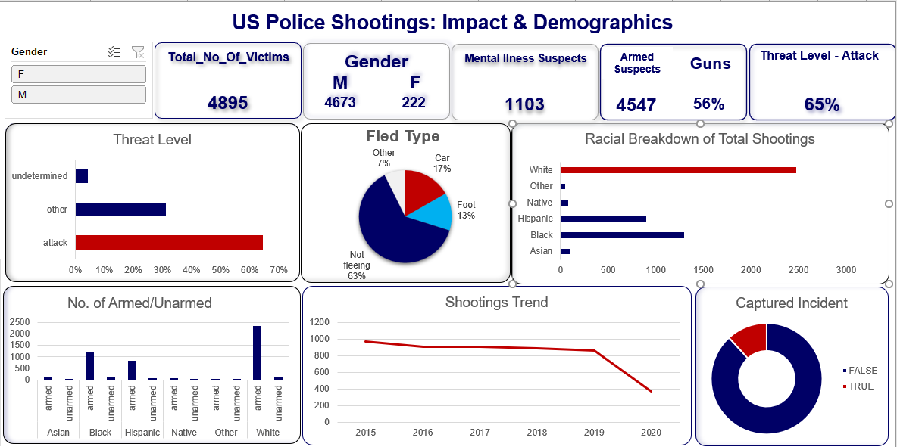

# US Police Shootings: Impact & Demographics Dashboard

## 📌 Project Overview
This project visualizes and analyzes data on **US Police Shootings** to explore patterns, demographic impacts, and trends over time.  
It leverages **Excel** dashboards to display key metrics such as victim demographics, threat levels, mental illness involvement, armed status, racial breakdowns, and fleeing behavior.

The primary goal is to create an **interactive, data-driven visualization** that enables clear insights into police use-of-force incidents across different groups and situations.

---

## 📊 Features of the Dashboard
- **Gender Breakdown** of victims
- **Total Number of Victims**
- **Mental Illness Involvement**
- **Armed vs. Unarmed Incidents**
- **Weapon Type Usage**
- **Threat Level Classification**
- **Fleeing Behavior**
- **Racial Breakdown of Shootings**
- **Trend Analysis (2015–2020)**
- **Captured Incident Status**

---

## 📂 Dataset
- **File:** `shootings-data.xlsx`
- **Source:** [The Washington Post Police Shootings Database](https://github.com/washingtonpost/data-police-shootings)
- **Columns include:**
  - `name` – Victim’s name
  - `date` – Date of incident
  - `manner_of_death` – Shot / shot and Tasered
  - `armed` – Weapon carried by the victim
  - `age` – Age of victim
  - `gender` – M/F
  - `race` – Race of victim
  - `city` / `state` – Location of incident
  - `threat_level` – Attack, other, undetermined
  - `flee` – Not fleeing, car, foot, other
  - `body_camera` – TRUE/FALSE
  - `signs_of_mental_illness` – TRUE/FALSE

---

## 🛠 Tools Used
- **Microsoft Excel** – Data cleaning, analysis, and visualization
- **Pivot Tables & Charts** – To aggregate and visualize data
- **Slicers & Filters** – For interactivity in the dashboard

---

## 📷 Dashboard Preview


---

## 🚀 How to Use
1. **Clone this repository**  
   ```bash
   git clone https://github.com/yourusername/us-police-shootings-dashboard.git
   ```
2. **Download the dataset** (`shootings-data.xlsx`)
3. **Open the Excel file** containing the dashboard.
4. Use **slicers and filters** to explore the data interactively.

---

## 📈 Key Insights from the Data
- **Males** are overwhelmingly more likely to be victims than females.
- **65%** of incidents involve an "attack" threat level.
- **56%** of victims were armed with guns.
- **White** victims make up the largest racial group, but **Black** and **Hispanic** individuals are disproportionately represented relative to their population sizes.
- Shootings have **declined since 2015**, but remain a significant concern.

---

## 📜 License
This project is licensed under the **MIT License** – you are free to use, modify, and distribute it with attribution.

---

## 🙏 Acknowledgments
- Dataset sourced from *The Washington Post* Police Shootings Database.
- Inspiration for dashboard layout from various Power BI / Excel visualization practices.
